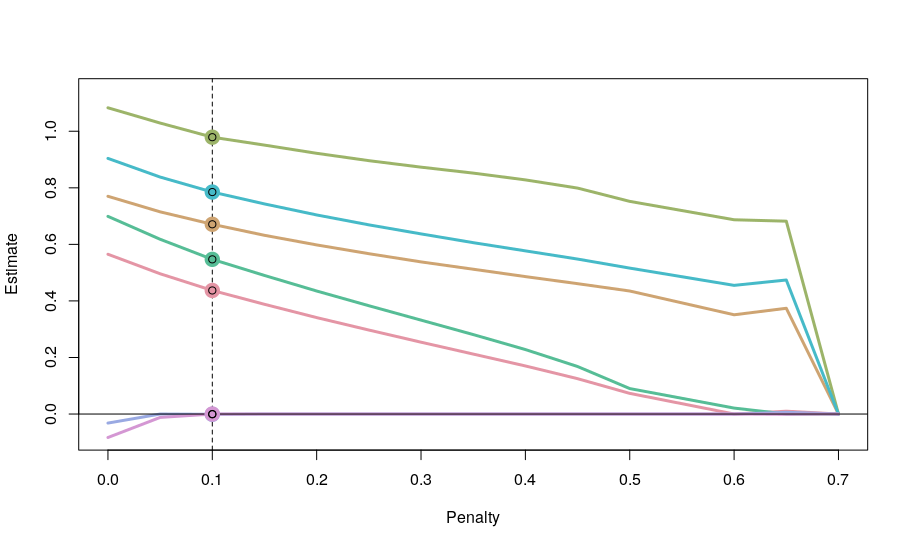

# RegSem
Based on: [Jacobucci 2017 regsem: Regularized Structural Equation Modeling](https://arxiv.org/pdf/1703.08489.pdf)
- 

## RegSemとは？
- Jacobucciによる[Regularized Structural Equation Model](https://www.ncbi.nlm.nih.gov/pmc/articles/PMC4937830/)のR実装。
  - 正則化構造方程式モデル。
  - 因子負荷量に罰則をかけて、共分散構造の正則化を図る。

### 理屈
- 共分散構造分析では文字通り「分散共分散行列」の構造を推定する。
  - RegSemでは主にRAM(Reticular Action Model)という共分散構造を仮定する
  - 非巡回な構造（f→B→C）みたいなやつ
- 因子分析の結果を3つの行列に分解する
  - F行列: 隣接行列。パスがつながる時1、つながらない時0となるような行列。
    - 変数×(変数+潜在変数)の行列。
    - 潜在変数間は相関しない仮定。
  - A行列: 因子負荷量の値が入る。
  - S行列: 説明変数の共分散行列
```r
regsem::extractMatrices(cfa_output)$`S` # 潜在因子と通常変数の分散共分散行列

# A1 A2 A3 A4 A5 O2 N3 f1
# A1  8  0  0  0  0  0  0  0
# A2  0  9  0  0  0  0  0  0
# A3  0  0 10  0  0  0  0  0
# A4  0  0  0 11  0  0  0  0
# A5  0  0  0  0 12  0  0  0
# O2  0  0  0  0  0 13  0  0
# N3  0  0  0  0  0  0 14  0
# f1  0  0  0  0  0  0  0  0

regsem::extractMatrices(cfa_output)$`F` # 変数 × (変数+潜在因子)の行列

# A1 A2 A3 A4 A5 O2 N3 f1
# A1  1  0  0  0  0  0  0  0
# A2  0  1  0  0  0  0  0  0
# A3  0  0  1  0  0  0  0  0
# A4  0  0  0  1  0  0  0  0
# A5  0  0  0  0  1  0  0  0
# O2  0  0  0  0  0  1  0  0
# N3  0  0  0  0  0  0  1  0

regsem::extractMatrices(cfa_output)$`A` # 因子負荷量 論文中lambda

# A1 A2 A3 A4 A5 O2 N3 f1
# A1  0  0  0  0  0  0  0  1
# A2  0  0  0  0  0  0  0  2
# A3  0  0  0  0  0  0  0  3
# A4  0  0  0  0  0  0  0  4
# A5  0  0  0  0  0  0  0  5
# O2  0  0  0  0  0  0  0  6
# N3  0  0  0  0  0  0  0  7
# f1  0  0  0  0  0  0  0  0
```
- これによって以下の共分散構造を推定する。
    $$\hat{\Sigma} = F(I-A)^{-1}S(I-A)^{-1}F^T$$
  - 逆行列を使うあたりで「正則化が使えるなあ」と思ったら勝ち。
  - この$F$の尤度を最大化するような$\Sigma$を推定する。
  - ペナルティはA行列かS行列。
    - どちらか一方の罰則効果がもう一方に影響するため、どちらか一方でいい
    - というか両方やると逆にやばいらしい。
  - 標準化して使おうね。

## 実装
- Rに`regsem`ライブラリがある。
  - [参考](https://arxiv.org/pdf/1703.08489.pdf)

### データ
- `lavaaan`にある謎データ`bfi`を使う。
  - [謎でもなかった](https://www.personality-project.org/r/html/bfi.html)
  - 性格・パーソナリティに関する項目と3つのデモグラがある。
  - 因子分析とかSEMとかでよく試されるらしい(そうなんすね)

```r
head(bfi)

# A1 A2 A3 A4 A5 C1 C2 C3 C4 C5 E1 E2 E3 E4 E5 N1 N2 N3 N4 N5 O1 O2 O3 O4 O5 gender education age
# 61617  2  4  3  4  4  2  3  3  4  4  3  3  3  4  4  3  4  2  2  3  3  6  3  4  3      1        NA  16
# 61618  2  4  5  2  5  5  4  4  3  4  1  1  6  4  3  3  3  3  5  5  4  2  4  3  3      2        NA  18
# 61620  5  4  5  4  4  4  5  4  2  5  2  4  4  4  5  4  5  4  2  3  4  2  5  5  2      2        NA  17
# 61621  4  4  6  5  5  4  4  3  5  5  5  3  4  4  4  2  5  2  4  1  3  3  4  3  5      2        NA  17
# 61622  2  3  3  4  5  4  4  5  3  2  2  2  5  4  5  2  3  4  4  3  3  3  4  3  3      1        NA  17
# 61623  6  6  5  6  5  6  6  6  1  3  2  1  6  5  6  3  5  2  2  3  4  3  5  6  1      2         3  21

```

### Regsemの前に
- 因子分析をする。
  - 因子分析の結果から解析に使う行列を抜き出してくるらしい。
  - `mod`で共分散構造を記述し`cfa`で因子分析です。

```r
library(lavaan) # 因子分析やSEMのラッパーとして優秀なライブラリ。

bfi2 <- bfi[1:250, c(1:5, 18,22)]
bfi2[,1] <- psych::reverse.code(-1, bfi2[,1])

mod <- "
f1 =~ NA * A1 + A2 + A3 + A4 + A5 + O2 + N3
f1~~1*f1
"
## まず因子分析を行う
cfa_output <- lavaan::cfa(mod, bfi2)
summary(cfa_output)
```
### Regsem
- `type`は正則化を選べる。
  - `alasso`でAdaptive Lasso
  - `ridge`でL2
  - `enet`でElastic net
  - `scad`や`mcp`などもある。詳細は別の話
- `cv_regsem`でクロスバリデーションが可能

```r
start_time <- proc.time()
output_regsem <- regsem::cv_regsem(cfa_output, type = "lasso",
                                   pars_pen = c(1:7), # NULLにすると潜在因子がすべての変数にパスを飛ばす。
                                                      ## 今回は各変数に1個ずつ飛ばすパスを仮定。
                                   n.lambda = 15,     ## 罰則項
                                   jump = .05        ## 罰則項の刻み幅
                                   )

# 警告メッセージ: 
#   regsem(model = model, lambda = SHRINK, type = type, data = data,  で: 
#            WARNING: Model did not converge! It is recommended to try multi_optim()
end_time <- proc.time()
diff_time <- end_time - start_time
print(paste0("calculated! time is spend: ", diff_time[1], "seconds"))
# [1] "calculated! time is spend: 1.206seconds"
```
- 収束しない場合は`multi_optim()`などでシミュレートすることもできるようだ。

- CVした結果のパラメータ値は`output_regsem$parameters`で参照できる。
```r
library(tidyverse)
output_regsem$parameters %>% 
  round(., 2) %>% 
  head

# f1 -> A1 f1 -> A2 f1 -> A3 f1 -> A4 f1 -> A5 f1 -> O2 f1 -> N3 A1 ~~ A1 A2 ~~ A2 A3 ~~ A3 A4 ~~ A4 A5 ~~ A5 O2 ~~ O2
# [1,]     0.56     0.77     1.08     0.70     0.90    -0.03    -0.08     1.52     0.69     0.53     1.84     0.88     2.45
# [2,]     0.50     0.72     1.03     0.62     0.84     0.00    -0.01     1.54     0.70     0.52     1.85     0.90     2.45
# [3,]     0.44     0.67     0.98     0.55     0.78     0.00     0.00     1.53     0.71     0.52     1.85     0.90     2.45
# [4,]     0.39     0.63     0.95     0.49     0.74     0.00     0.00     1.57     0.72     0.51     1.89     0.92     2.45
# [5,]     0.34     0.60     0.92     0.44     0.70     0.00     0.00     1.58     0.73     0.50     1.92     0.93     2.45
# [6,]     0.30     0.57     0.90     0.38     0.67     0.00     0.00     1.60     0.75     0.50     1.94     0.94     2.45
# N3 ~~ N3
# [1,]     2.29
# [2,]     2.30
# [3,]     2.29
# [4,]     2.30
# [5,]     2.30
# [6,]     2.30

```

- 罰則項$\lambda$の強さなどはここで確認できる・
  - なんか$\lambda = 0.55$でやばくなっているが、BICみると0.05くらいがちょうど良さそう。

```r
output_regsem$fits

#      lambda conv   rmsea         BIC         chisq
# [1,]   0.00    0 0.08255    5713.574      37.08935
# [2,]   0.05    0 0.08213    5710.476      39.48472
# [3,]   0.10    0 0.08620    5710.270      44.77133
# [4,]   0.15    0 0.09553    5716.838      51.33941
# [5,]   0.20    0 0.10659    5725.489      59.99048
# [6,]   0.25    0 0.11836    5735.739      70.24050
# [7,]   0.30    0 0.13064    5747.581      82.08211
# [8,]   0.35    0 0.14345    5761.176      95.67710
# [9,]   0.40    0 0.15708    5777.038     111.53937
# [10,]   0.45    0 0.17225    5796.381     130.88249
# [11,]   0.50    0 0.19163    5823.694     158.19503
# [12,]   0.55    1 0.00000 -987208.231 -992884.71596
# [13,]   0.60    0 0.21395    5865.326     205.32088
# [14,]   0.65    0 0.22054    5869.831     204.33220
# [15,]   0.70    0 0.24312    5959.428     321.39495
```
- `plot(output_regsem, show.minimum = "BIC")`で、例の図とかも見られる。


- いつもどおり罰則が強くなると0に圧縮される。


```r
output_regsem$final_pars

#f1 -> A1 f1 -> A2 f1 -> A3 f1 -> A4 f1 -> A5 f1 -> O2 f1 -> N3 A1 ~~ A1 
#0.437     0.671     0.979    0.547    0.785   -0.001    0.000    1.535   
#A2 ~~ A2 A3 ~~ A3 A4 ~~ A4 A5 ~~ A5 O2 ~~ O2 N3 ~~ N3 
#0.710    0.524    1.849    0.904    2.447    2.295 

```

## 結局使い方は？
- `model <- "ここに共分散構造を書く"`
- `lavaan::cfa(model, data)`で因子分析をする
- その結果を`regsem::cv_regsem`に突っ込む。
  - 収束しない場合は`regsem::multi_optim()`などを使う
- 使うのは`ouptut$final_pars`
  - ここから製表・可視化は別のお話。


## 次回は？
- 因果Lassoがあるらしい。